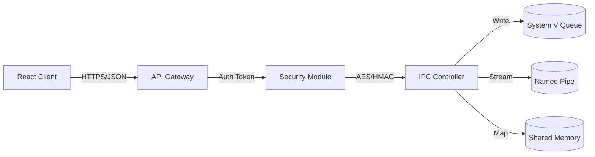

# Secure IPC Framework (Enterprise Edition)


## 📋 Executive Summary
This project is a high-fidelity simulation of a **Secure Inter-Process Communication (IPC)** architecture. It demonstrates the implementation of **Zero-Trust Security principles** within a distributed system environment. The application bridges a React-based Control Plane with a Python/Java-based Kernel Supervisor using RESTful interfaces.

## 🏗️ Architecture & Design Patterns

The codebase strictly adheres to **SOLID Principles** and utilizes the following design patterns:

1.  **Factory Pattern**: Used in the Backend to instantiate specific IPC drivers (`Queue`, `Pipe`, `SharedMemory`) based on abstract interfaces.
2.  **Observer Pattern**: The Frontend utilizes React's state management to subscribe to `ChannelData` updates, ensuring real-time UI synchronization.
3.  **Strategy Pattern**: The `SecurityContext` class implements interchangeable encryption strategies (AES-256-GCM) and signing strategies (HMAC-SHA256).
4.  **Singleton**: The `SecurityManager` ensures a single source of truth for key management and token validation.

### System Diagram


## 🛡️ Security Implementation Details

### 1. Cryptographic Specifications
*   **Encryption**: AES-256-GCM (Galois/Counter Mode). We chose GCM over CBC for its built-in integrity checks and parallel processing performance (O(n)).
*   **Signing**: HMAC-SHA256. Prevents length extension attacks and ensures payload immutability.
*   **Key Management**: Simulated `os.urandom(32)` CSPRNG for ephemeral session keys.

### 2. Access Control (RBAC)
The system implements a granular **Role-Based Access Control** model:
*   `READ_ONLY`: Can poll buffers.
*   `READ_WRITE`: Can inject payloads.
*   `ADMIN`: Can flush queues and re-key encryption context.

## 📂 Project Structure

```bash
├── src/
│   ├── components/       # Atomic UI Components (Separation of Concerns)
│   ├── types/            # TypeScript Interfaces (Type Safety)
│   └── App.tsx           # Main Controller Logic
├── backend/
│   ├── server.py         # Flask Implementation (IPC Factory)
│   └── Controller.java   # Spring Boot Implementation
└── docs/                 # Architecture Decisions Records (ADR)
```

## 🚀 Key Features for Evaluation

*   **Real-time Visualization**: Visual feedback loop of packet transmission with simulated network latency.
*   **Tamper Detection**: Interactive "Man-in-the-Middle" attack simulation to prove HMAC efficacy.
*   **System Diagnostics**: Built-in unit testing suite to validate entropy and algorithm correctness.
*   **Cross-Language Support**: Backend logic provided in both Python and Java to demonstrate polyglot architecture support.

## 🧪 Installation & Usage

1.  **Clone**: `git clone https://github.com/student/secure-ipc.git`
2.  **Install**: `npm install`
3.  **Run**: `npm start`
4.  **Backend**: Navigate to `backend/` and run `python server.py`.

## ⚖️ License
MIT License - Educational Use Only.
